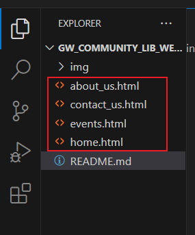
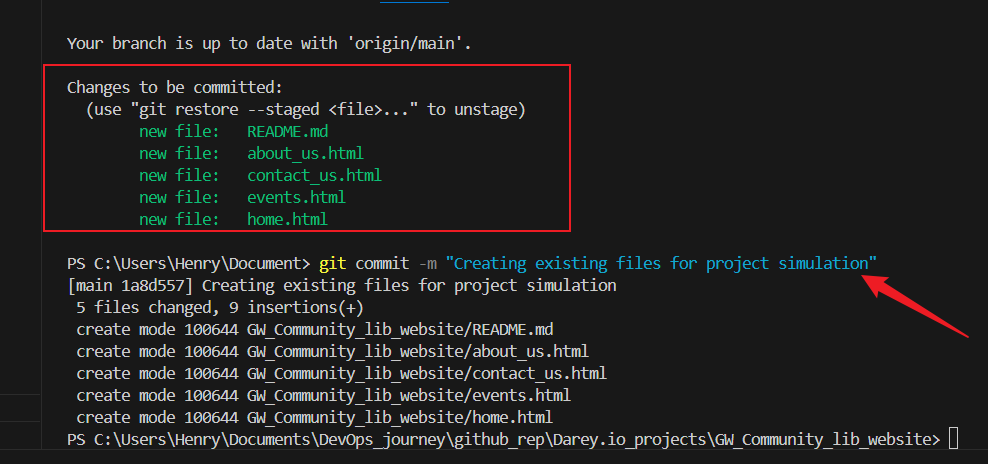
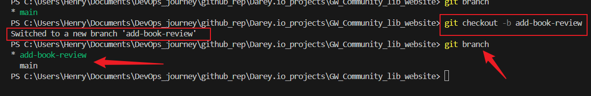
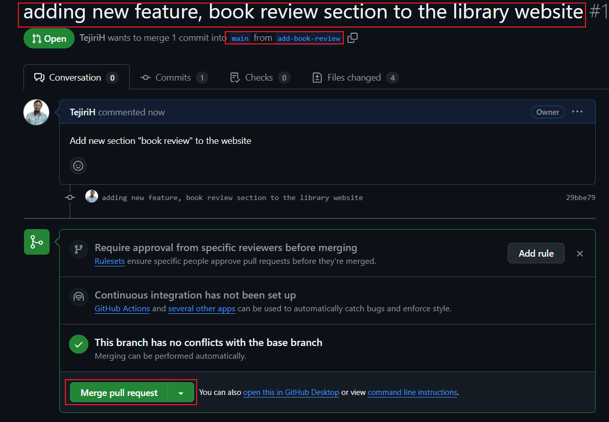
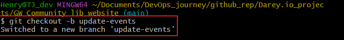
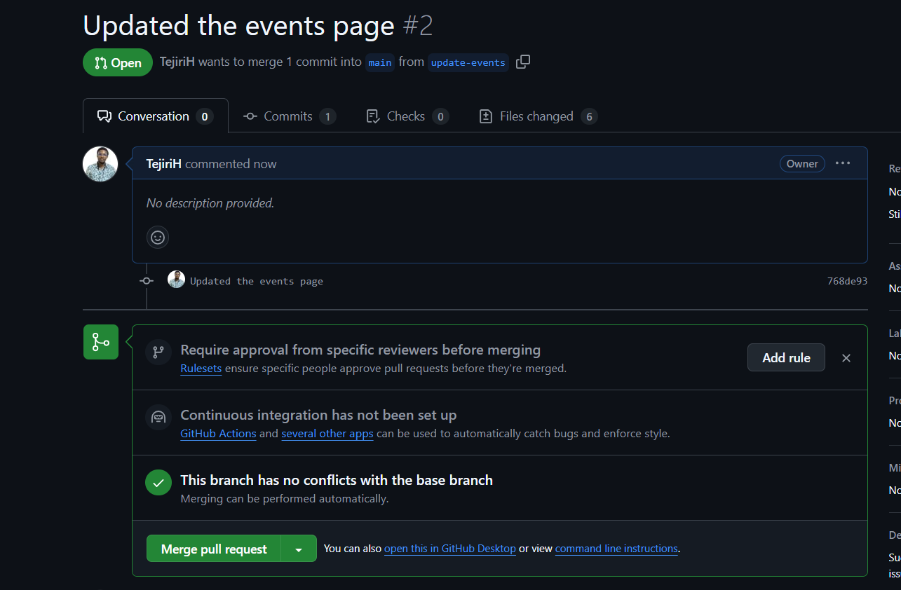

# Enhancing a Community Library Website Project

## Simulating the roles of two contributors :"Morgan" and "Jamie".

Morgan will focus on adding the Book Reviews section, while james will update the Event's page with new community events.

As a simulation for the existing files the team has, we created the home, about_us, events and contact_us files and staged, committed and pushed them to the main branch repository in github.

### Adding book section to the Directory
Branch was created by morgan and switched to for the book review feature. 

Book section was added by morgan and then staged, committed and pushed to github.

Book review section was pushed to git hub book_review branch by morgan and was compared, reviewed and merged to main branch.

Main branch has been updated and morgan's work completed, Jamie's have been informed about the repository update and is now making a pull request to update the event page with a current repository.

## Updating events page.

Jamie makes a branch called update event and made a pull request from the main branch on git hub.

Jamie updates the event page and stage, commit and pushed it up to the update event for review and merging.

Hence collaboration was completed and project successful..
