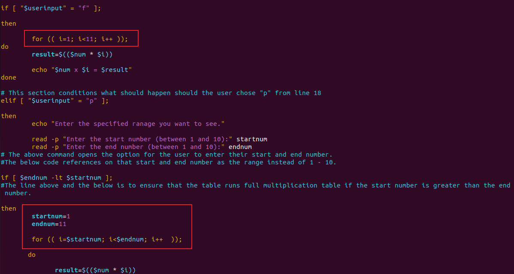

# Linux Shell Scripting

## Bash Scirpt For Generating a Multipliction Table

**Objective:** To Create a Bash script that generates a multipliction table for a number entered by the user. This project aims to increase familiarity using loops, handling user input, and applying conditional logic in Bash scripting.

**Project Description:** Script should promt the user to enter a number and then ask if they prefer to see a full multiplication table from 1 to 10 or a partial table within a specified range, based on the user's choice and the script will display the corresponding multiplication table and afterwards the script prompts the user if they want to run with a different number.

**Step 1:**  We created a file with vim editor tool and then started it with the shebang line.

"#!/bin/bash"

**Step 2:** We then wrote a script that promts the user to enter a number to generate its multiplication table from 1 to 10 followed by another similiar script that describes what how we want to see the result, either full table or partial.
 
"
read -p "Enter a number to generate its multiplication table:" num

read -p "Do you prefer to see a full or partial table from 1 to 10? (f/p):" userinput "

If they select full, it generates a multiplication table of 1 to 10 as shown below

we wrote a script combining the if-else  and for loop control statement as can be seen in the below command snippet

"
if [ "$userinput" = "f" ]; 

then

	for i in $(seq 1 1 10)

do
	result=$(($num * $i))

	echo "$num x $i = $result"
done
"

**Challenges:** The normal range script we knew did not work and we kept trying until we found a range which worked because it was neccessary to run the for loop.
We also noticed running multiplication command required a way to write it, which we did not know previously until we researched it out.

**Step 3:** We continued with the if-else statement in step 1 to generate a partial table should the user decide to choose 'Partial table from the step 1. we have to find out also from the user the range they want to see, such that they have to choose the first range to the last range they want to see, the below snippet gives continued script to this effect.

elif [ "$userinput" = "p" ];

then
	echo "Enter the specified ranage you want to see."

	read -p "Enter the start number (between 1 and 10):" startnum
	read -p "Enter the end number (between 1 and 10):" endnum

We wanted to create a script that incase the user entered an invalid range such as making the first range number bigger in value than the last range number. for example instead of range 2 to 8, they input 8 to 2, the script generates a full multiplication table of 1 to 10 instead and we did this by nexting an if-else statement inside another if-else statment same with the for loop, see the command snippet below

"if [ $endnum -lt $startnum ]; 

then
	startnum=1
	endnum=10

  	for i in $(seq $startnum 1 $endnum)
  
    	do 
	      result=$(($num * $i))
               echo "$num x $i = $result"
       done

else
	for i in $(seq $startnum 1 $endnum)
	
	do
		result=$(($num * $i))
		echo "$num x $i = $result"
	done

fi
fi
"

**Challenges:** To create the partial table was tricky because we needed multiple nested if-else and for loop but whenever we finish inputing the range, it wasn't continuing the script because i was not placing the conditions right, eventually i had to assign a new variable to the range if the user inputed an invalid range and used those default range value to run a full table in the event of an invalid range. 

**Step 4:** We go ahead to write a script with the "while loop statement" that would promt the user if they wanted to run another multiplication table with a different number if "yes", we run the entire process again and if "no" it ends the cycle and if a value other than "yes or no", it displays a note to enter either "yes or no". We run the if statements with a c-style.

Utilizing the "while loop" and the c-style for loop statement, we write a script that enquires if the user is intersted in running a different number for multiplication table and if the response is "no" then the cycle breaks.

"while true;
do

read -p "Do you want to try a new number? (yes/no): " secondinput

if [ "$secondinput" = "no" ]; 

then
	break #This ends the loop if the user inputs no "

the below image describes it
 
  

But if the user selects yes we went on to rewrite the entire script but this time in c-style as seen in the below snippet 

"
elif [ "$secondinput" = "yes" ]; 

then

read -p "Enter a number to generate its multiplication table:" num

read -p "Do you prefer to see a full or partial table from 1 to 10? (f/p):" userinput

if [ "$userinput" = "f" ];

then

	for (( i=1; i<11; i++ ));
do
        result=$(($num * $i))

        echo "$num x $i = $result"
done
"

For enhanced user interactions we added a feature incase the user enters a value other than "yes or no", the script promts the user to enter the right value, which is "yes or no".

"
else 
	echo "Invalid input, please enter 'yes' or 'no'." #This is what displays when a value that is neither yes nor no is inputed
"

**Challenges:** Not being very use with while loop, we learnt it afresh and initiated the loop but i missed a ";" and that affected the script on a line but was not showing us why that line was being affected and even when we removed that line, the next line gets an error, so we had to search the code one after the other and saw that we missed a semi-colon somewhere and then the script was complete.

And so we completed the Project, below is the entire script

"
#!/bin/bash

#This line promts the user to enter a numer they want to create the multiplication table for
read -p "Enter a number to generate its multiplication table:" num

read -p "Do you prefer to see a full or partial table from 1 to 10? (f/p):" userinput

#This line below describes the condition for what happens if the user picks "f" to the above command line

if [ "$userinput" = "f" ]; 

then

	for i in $(seq 1 1 10)

do
	result=$(($num * $i))

	echo "$num x $i = $result"
done

#This section conditions what should happen should the user chose "p" from line 18
elif [ "$userinput" = "p" ];

then
	echo "Enter the specified ranage you want to see."

	read -p "Enter the start number (between 1 and 10):" startnum
	read -p "Enter the end number (between 1 and 10):" endnum
#The above command opens the option for the user to enter their start and end number.
#The below code references on that start and end number as the range instead of 1 - 10.

if [ $endnum -lt $startnum ]; 
#The above  line and the one below is to ensure that the table runs full multiplication table if the start number is greater than the end number.

then
	startnum=1
	endnum=10

  	for i in $(seq $startnum 1 $endnum)
  
    	do 
	      result=$(($num * $i))
               echo "$num x $i = $result"
       done

else
	for i in $(seq $startnum 1 $endnum)
	
	do
		result=$(($num * $i))
		echo "$num x $i = $result"
	done

fi
fi

#This line promts the user to enter a numer they want to create the multiplication table for

while true;
do

read -p "Do you want to try a new number? (yes/no): " secondinput

if [ "$secondinput" = "no" ]; 

then
	break #This ends the loop if the user inputs no

elif [ "$secondinput" = "yes" ]; 

then

read -p "Enter a number to generate its multiplication table:" num

read -p "Do you prefer to see a full or partial table from 1 to 10? (f/p):" userinput

#This line below describes the condition for what happens if the user picks "f" to the above command line

if [ "$userinput" = "f" ];

then

	for (( i=1; i<11; i++ ));
do
        result=$(($num * $i))

        echo "$num x $i = $result"
done

#This section conditions what should happen should the user chose "p" from line 18
elif [ "$userinput" = "p" ];

then
        echo "Enter the specified ranage you want to see."

        read -p "Enter the start number (between 1 and 10):" startnum
        read -p "Enter the end number (between 1 and 10):" endnum
#The above command opens the option for the user to enter their start and end number.
#The below code references on that start and end number as the range instead of 1 - 10.

if [ $endnum -lt $startnum ]; 
#The line above and the below is to ensure that the table runs full multiplication table if the start number is greater than the end number.

then
        startnum=1
       	endnum=11

	for (( i=$startnum; i<$endnum; i++  ));

       do

              result=$(($num * $i))

                echo "$num x $i = $result"
        done

else
	 for (( i=$startnum; i<$endnum; i++ ));

       	 do
 
  		 result=$(($num * $i))
  
   		 echo "$num x $i = $result"
         done

fi
fi

else 
	echo "Invalid input, please enter 'yes' or 'no'." #This is what displays when a value that is neither yes nor no is inputed
fi

done
"
