# E-Commerce Platform Deployment with Git, Linux, and AWS

## **Objective**: To develop an e-commerce website for a new online marketplace named "Marketpeak", utilizing Git for version control, develop the platform in a Linux environment, and deploy it on an AWS EC2 instance.

### Initialize Git Repository
Created a project directory named "MarketPeak_Ecommerce" and initialize a Git repository to manage my version control.

"mkdir MarketPeak_Ecommerce
cd MarketPeak_Ecommerce
git init"

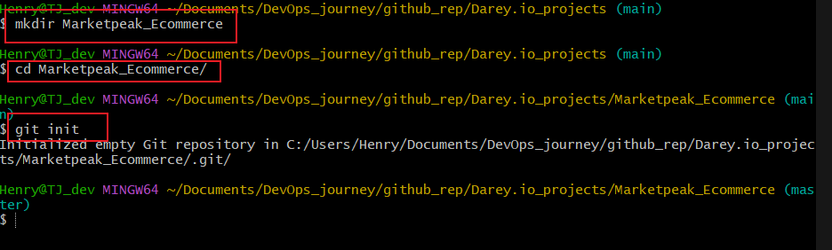

We added our website files to the marketpeak directory and configured our details on git with the following commands.

" git add .
git config --global user.name "myusername"
git config --global user.email "myemail@example.com"
git commit -m "Initial commit with basic e-commerce site structure" "

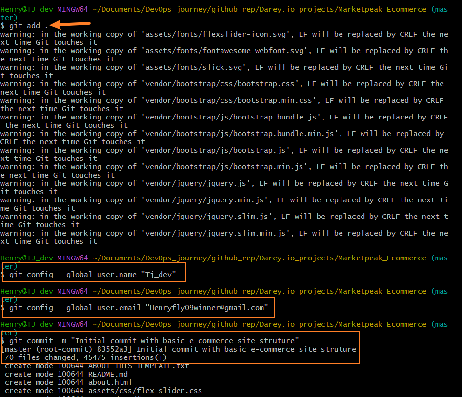

We created a repository on github named "Darey.io_Project" which i use as a folder for all Darey.io works and then copied the url to the terminal and ran the following command.

"git remote add origin https://github.com/your-git-username/MarketPeak_Ecommerce.git"

"git push -u origin main"

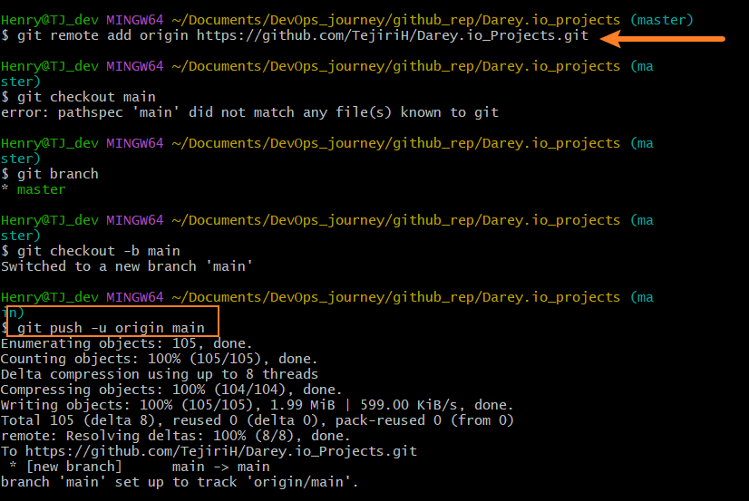

### AWS Deployment

We launched an ec2 instance using Amazon Linux AMI OS and configured it to have 1gb ram and 8gb of memory.

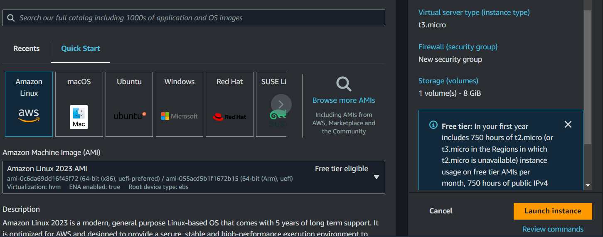

After which we connected to our ec2 instance from our git bash terminal successfully.
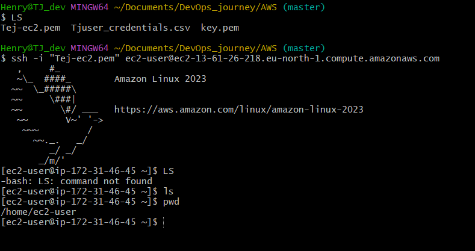

Next we clone our git repository from github on the ec2 instance using HTTPS, which we did successfully with.

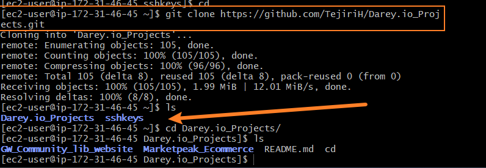

We installed yum package manager as Amazon linux AMI uses yum as default package manager, we therefor installed yum and apache webserver with the following code snippet. Note: apache word is represented with httpd on this machine.

"sudo yum update -y
sudo yum install httpd -y
sudo systemctl start httpd
sudo systemctl enable httpd"

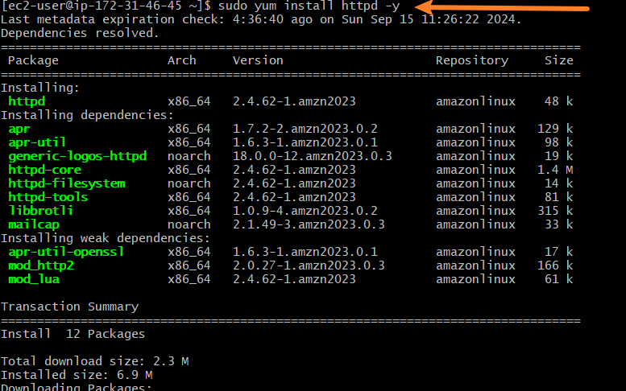

We configured apache my removing any files on the default directory where web files are hosted "/var/www/html/" and then copied the files from our Marketpeak directory into the "/var/www/html" directory.

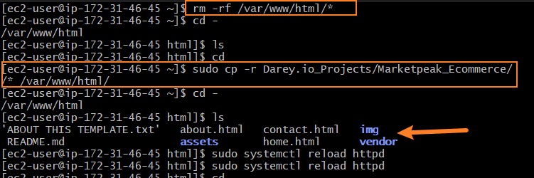.

We also had to configure our apache http config file in our /etc/httpd/conf/http.confd file and looked for the command "<IfModule dir_module>
    DirectoryIndex index.html home.html contact_us.html about.html
</IfModule>", we included the following files to enable apache read all the files and not just the index file.

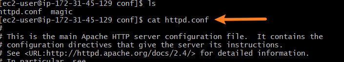
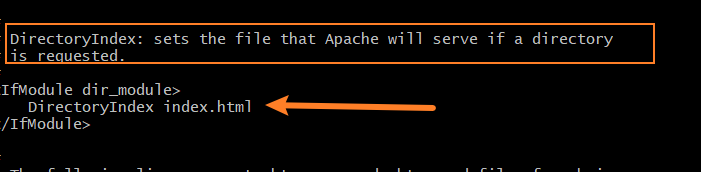

After which we restarted our webserver with the below code and searched the browser with our public ip address and here it goes, we hosted our web on ec2 amazon web.

"sudo systemctl restart httpd"

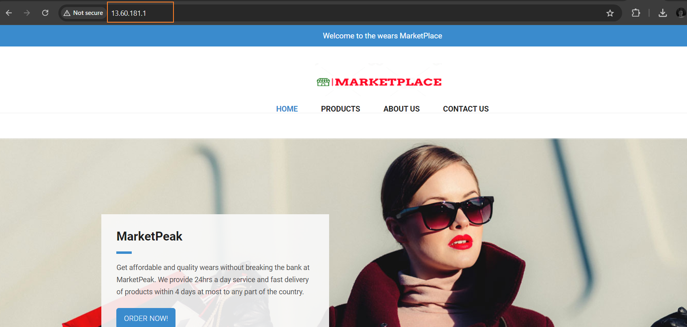

### Continous Integration and Deployment workflow

We want to ensure a smooth workflow for developing and deploying our e-commerce platform, which includes, making changes in a development environment, utilizing version control with Git, and deploying updates to our AWS production server.

**Step 1**: Developing New Features and Fixes
We create a new branch called *development* and we switched to this branch to run fix before uploading it for review and merge.

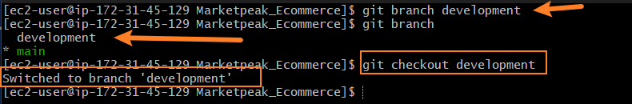

we implemented our change using vim editor.

**Step 2:** Version Control with Git
Version control describes efficient controling of several changes to a code, more like an historical recording of an event changing over time.

we therefore staged and committed our changes with the below code snippet 

"git add .
git commit -m "Add new features or fix bugs" "

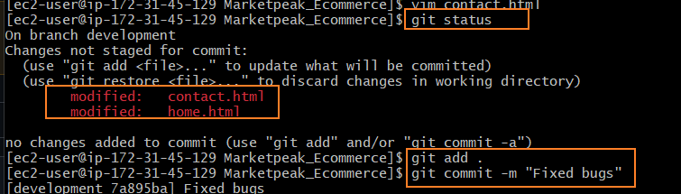

When we tried to upload to github, we met an authentication error, we then created an sshkey for authentication and uploaded on github and with that authenticated our access to github and ran the push command to github development branch for review and merging.

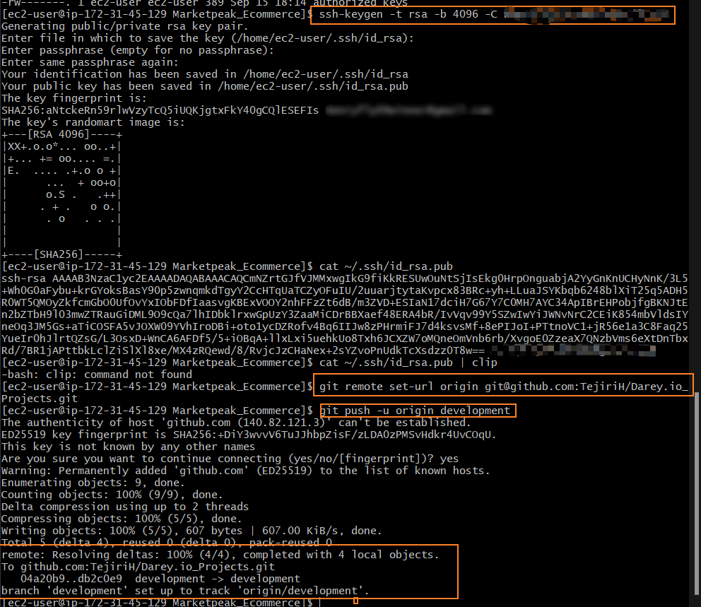
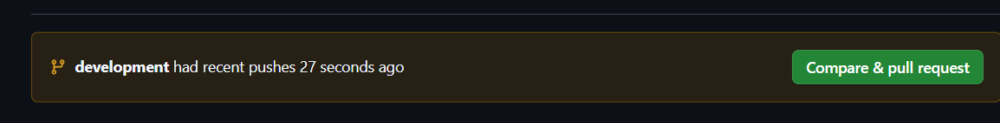

**Step 3:** Pull Requests and Merging to the Main branch

We created a pull Request which was reviewed and merged after passing review

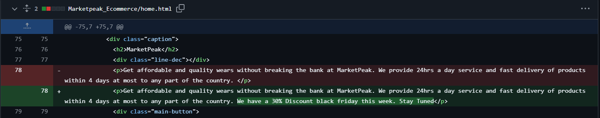

**Step 4:** Deploying Updates to the Production Server.
We pulled the latest changes from github main branch and copied to our default directory hosting our web and restarted our webserver with the command 

"sudo systemctl reload httpd"

**Step 5:** Testing the New Changes, we accessed the website with the public IP address of our EC2 instance and checked for our changes, they were effective.

Hence the Project was successfully completed.

